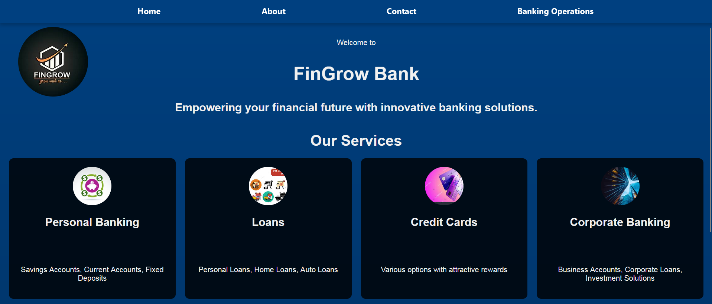
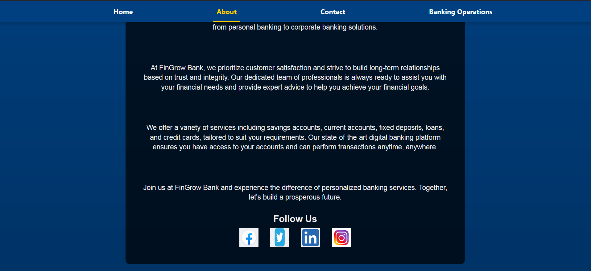
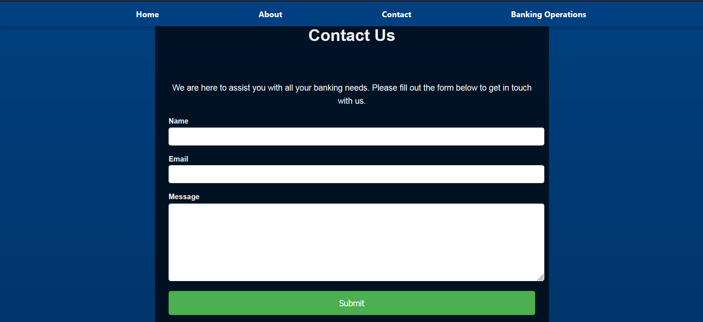
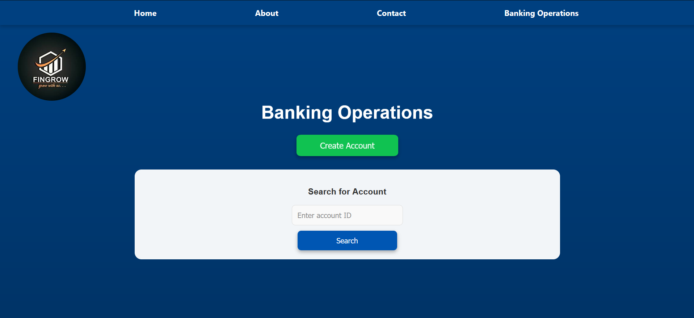
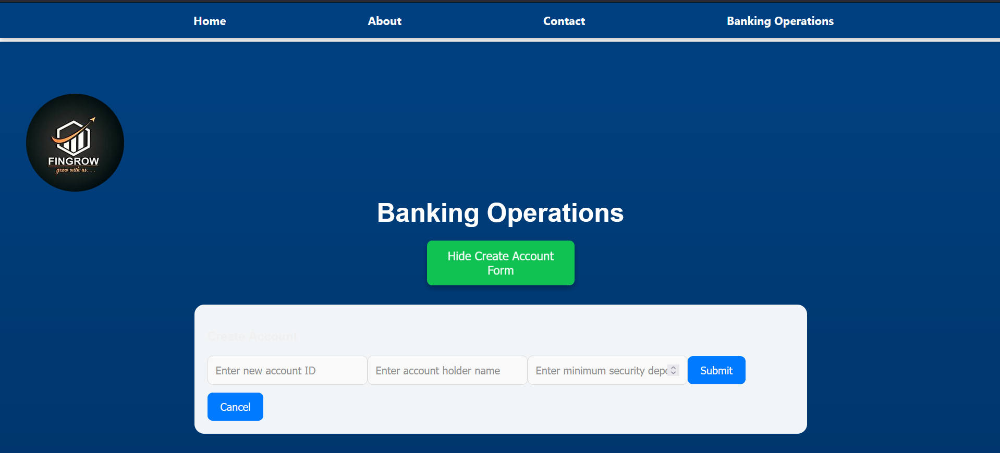
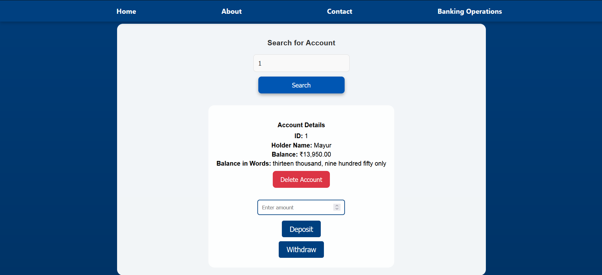
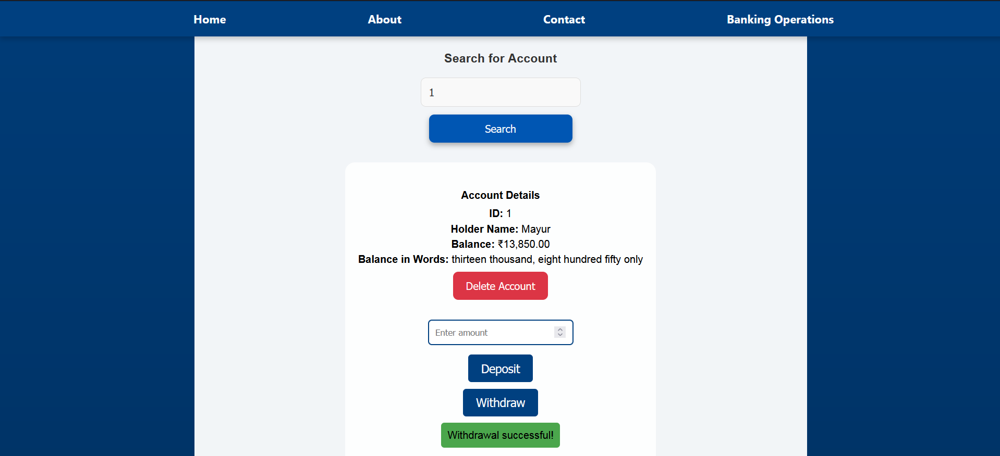
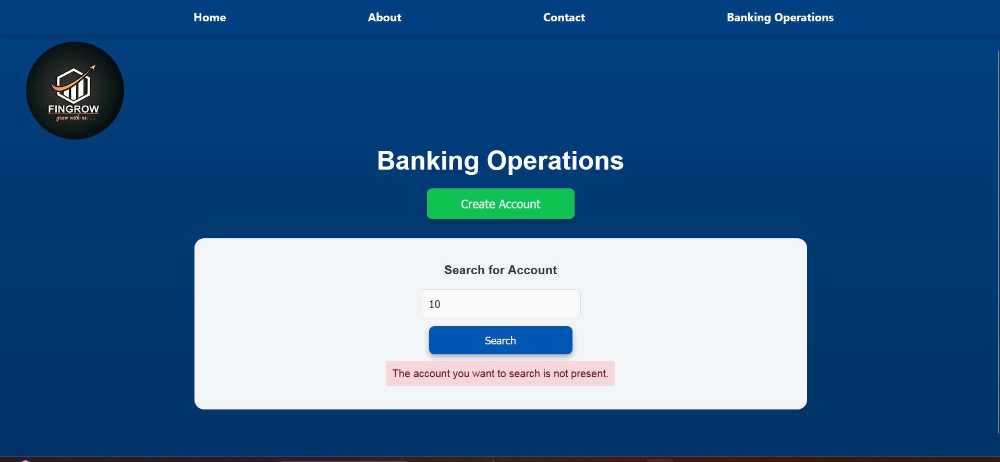

# Banking Application

## Overview

This is a full-stack banking application built using React.js for the frontend and Spring Boot for the backend. The application allows users to create accounts, deposit and withdraw funds, and view account details. It features a user-friendly interface with modern design and animations.

## Features

- **Account Management:** Create, view, deposit, withdraw, and delete accounts.
- **Responsive Design:** Optimized for desktop and mobile devices.
- **Dark Mode:** Toggle between dark and light themes.
- **Animations:** Smooth animations for various UI elements.
- **Form Validation:** Ensure correct input data from users.
- **REST API:** Backend API for account operations.

## Technologies Used

### Frontend

- React.js
- HTML5
- CSS3
- JavaScript
- Material-UI

### Backend

- Spring Boot 3.3.0
- Maven
- Spring Data JPA
- H2 Database

## Getting Started

### Prerequisites

- Node.js (for running the frontend)
- Java Development Kit (JDK) (for running the backend)
- Maven (for managing backend dependencies)

### Installation

1. **Clone the repository:**
    ```sh
    git clone https://github.com/yourusername/banking-app.git
    cd banking-app
    ```

2. **Backend Setup:**
    ```sh
    cd banking-app_backend
    mvn clean install
    mvn spring-boot:run
    ```

3. **Frontend Setup:**
    ```sh
    cd ../banking-app_frontend
    npm install
    npm start
    ```

### Usage

- Navigate to `http://localhost:3000` in your web browser to use the application.

## Project Structure

### Frontend

- **src/components:** React components for various parts of the UI.
- **src/assets:** Images and other static assets.
- **src/App.js:** Main app component.

### Backend

- **src/main/java/com/example/banking:** Main package containing controllers, services, repositories, and entities.
- **src/main/resources:** Configuration files, including `application.properties`.

## Screenshots











## API Endpoints

### Account Controller

- `POST /api/accounts` - Create a new account.
- `GET /api/accounts/{id}` - Retrieve account details by ID.
- `POST /api/accounts/{id}/deposit` - Deposit funds into an account.
- `POST /api/accounts/{id}/withdraw` - Withdraw funds from an account.
- `GET /api/accounts` - Get all accounts.
- `DELETE /api/accounts/{id}` - Delete an account by ID.

### Example Requests

#### Create Account

```sh
curl -X POST "http://localhost:8080/api/accounts" -H "Content-Type: application/json" -d '{
  "name": "John",
  "balance": 1000
}'
